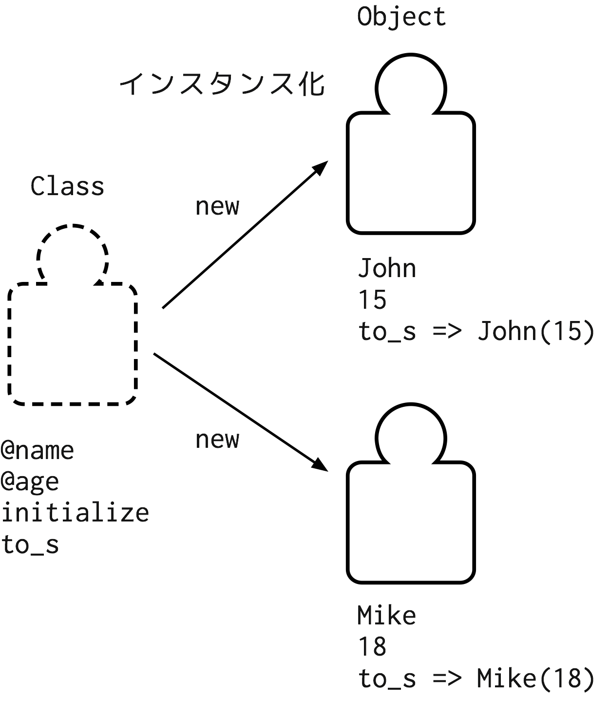

# 課外プロジェクト 2015 実践的プログラミング
## ~ Ruby II ~
2015 11/30 渡部未来・齊藤智博
資料URL: https://github.com/tspider0176/RubyTutorial-for-SCCP

## 1 はじめに

前回まではRubyの基本的な考え方やよく使うコレクション(配列・Hash)などの使い方を勉強してきた。
今回は関数、そしてオブジェクト指向を通してアプリケーション作りのためのプログラミングを学んでいく。オブジェクト指向は、人・言語などによってまったく考え方が異なる。この資料では筆者のRubyにおけるオブジェクト指向の考え方を説明していくが、限られた考え方・機能しか説明しないため、必ず別途資料を参照して理解を深めて頂きたい。

- Ruby 2.2.0 リファレンスマニュアル (http://docs.ruby-lang.org/ja/2.2.0/doc/index.html)
- オブジェクトの理解から始めるRuby (http://melborne.github.io/2013/02/07/understand-ruby-object/)
- 初めてのRuby (http://www.amazon.co.jp/db/4873113679)
- パーフェクトRuby (http://www.amazon.co.jp/gp/product/4774158798)

## 2 関数

Rubyは、すべての値がオブジェクトな純粋なオブジェクト指向であるため、関数ではなくメソッドであるが、ここでは敢えて関数として話を進めていく。

まずはじめに与えた数値の二乗を返す関数は以下のように定義、呼び出し実行される。
```
def square(x)
  x * x
end

square(3)
=> 9
square(1.5)
=> 2.25
square('aaa')
=> TypeError: can't convert String into Integer
```
この時点でC言語と比べると、一見些細だが気をつけるべき点がいくつかある。大きくは型が明記されない点である。これはRubyがScript言語で動的型付け言語だからである。これは前回の資料でも同様だったので大丈夫だと思われる。以上の理由により戻り値と引数の型は存在しない。注意するべきは呼び出し時で型がないため、どんな値も渡すことが出来てしまう。ここでは整数・小数は掛け算をすることが出来るので問題なく計算が行われるが、文字列は掛け算をすることができないため、型の「実行時エラー」となってしまう。Rubyはコンパイルして型をチェックできないのが大きな欠点となる。

### 2.1 定義

関数の定義は以下のようになる。

```
def 関数名(仮引数名, ...)
  式
  ...
end
```

いくつかの注意するべき点は先ほど述べた通りだが、関数の内部について着目すると式の集まり(集合)になっていることがわかる。Rubyの関数は最後に評価された式を戻り値として使うため*return*キーワードを明記する必要はない。それを踏まえると以下の例は何を返すだろうか。

```
def even_double(x)
  if x % 2 == 0 then
    x * 2
  else
    x
  end
end

even_double(3)
=> 3
even_double(4)
=> 8
```

ifなどの制御式やmapなどの多くのイテレータが値を返す意味がわかっただろうか。Rubyの関数についてまとめると以下のようになる。

- 型は明記されない(実行時に決まる)
- 関数は式の集合である
- 最後に評価された式が戻り値となる

以上を抑えれば基本的な関数は作れるはずだ。

演習問題: 名前を入力したらイニシャル(文字列)を返す関数*initial*を作れ。
また、名前の配列の配列からイニシャルの配列を返すコードも書け。

```
initial('John', 'Keneddy')
=> "J.K"
names = [["John", "Kennedy"], ["Barack", "Obama"], ["George", "Washington"], ...]
# コード
=> ["J.K", "B.O", "G.W", ...]
```

### 2.2 デフォルト引数

関数を利用するときに普段は省略したいが、あるときはオプションといて使いたい引数などがあるとする。そういう時はデフォルト引数を用いる。

```
def even_double_plus(x, t=0)
  if x % 2 == 0 then
    x * 2
  else
    x + t
  end
end

even_double_plus(3)
=> 3
even_double_plus(3, 5)
=> 8
```

演習:

名前を入力したらイニシャル(文字列)を返す関数*initial*を作れ。
ただし、ミドルネームも考慮せよ。

```
initial('Barack', 'Obama')
=> B.O
initial('John', 'F', 'Keneddy')
=> J.F.K
```

デフォルト引数ではどうにも上手く行かない場合は、前回やったハッシュを引数として使うと、
より柔軟に関数が書けるので覚えておこう。

## 3 クラス

### 3.1 オブジェクトとクラス定義

これまで何度か触れているように、Rubyはオブジェクト指向言語である。
Rubyに存在する値はすべてオブジェクトである。
オブジェクトは状態(フィールド)と振る舞い(メソッド)を持つ。
オブジェクトを作るには、オブジェクトの型を定義するためクラスを利用する。
簡単なクラスの例を以下に示す。

```
class Human
  def initialize(name, age)
    @name = name
    @age = age
  end

  def to_s
    "#{@name}(#{@age})"
  end
end

Human.new('John', 15)
=> John(15)
Human.new('Mike', 18)
=> Mike(18)
```

クラスの中には関数を書くことができ、これを*メソッド*と呼ぶ。
メソッドの基本的な書き方は、2節で書いた関数の書き方と一緒である。
上の例では、*initialize*と*to_s*の２つのメソッドが定義されているが、これはどちらも特殊な意味を持つメソッドである。クラスからオブジェクト生成するには*new*というキーワードを使う必要がある。*new*キーワードを使ってオブジェクトを生成することを「インスタンス化」と呼ぶ。
この「インスタンス化」時に、呼び出されるメソッドが*initialize*メソッドである。
*initialize*の定義は自由だが、基本的にはオブジェクトを構成するための初期値の代入処理を書くことが一般的である。また、*initialize*メソッドのことをコンストラクタと呼ぶことがある。
オブジェクトはそれぞれに固有の状態を持っており、この状態を*フィールド*と呼ぶ。
フィールドは変数の一種で、@(アットマーク)を名前の先頭に付けることで宣言でき、どのメソッドでも同じ参照を指す。上の例では、コンストラクタで*@name*と*@age*２つのフィールドが引数name, ageで初期化され、*to_s*メソッドで参照されている。
*to_s*メソッドは、オブジェクトを標準出力などで表現するときの文字列を定義するメソッドである。
*puts*メソッドなどでオブジェクトを出力すると*to_s*を明記しなくても、暗黙的に呼びだされていることが確認できる( puts Human.new('John', 15) )。
以上が簡単なクラス定義とオブジェクト生成の流れだが、最初はとても複雑に見えるので以下に図で表す。



以下にクラスの定義を示す。

```
class クラス名
  式 ...
end
```

クラスの中にはメソッドを列挙するが、上の定義では式の列挙になっている。
メソッド以外の式を記述するとどのような挙動を示すか試してみると良いだろう。

演習:

名前を表す(ミドルネームも考慮せよ)クラス*Name*を定義し、自然に出力されるように*to_s*を定義せよ。また、クラス*Human*の*name*をクラス*Name*のインスタンスを使用せよ。

```
Name.new('Barack', 'Obama')
=> "B.O"
Name.new('George', 'W', 'Bush')
=> "G.W.B"
Human.new('Barack', 'Obama', 54)
=> "Barack.Obama (54)"
Human.new('George', 'W', 'Bush', 69)
=> "George.W.Bush (69)"
```

上の例のようにあるオブジェクト(クラス)があるオブジェクト(クラス)を持っている関係をHAS-Aの関係と呼ぶ(Human has a Name.)。
オブジェクトについてまとめると、

- クラスを元にオブジェクトは作られる
- オブジェクトは状態(フィールド)と振る舞い(メソッド)を持つ
- コンストラクタ(initialize)でオブジェクトの初期化が行われる

となる。
オブジェクト指向をすることで、構造を使い回すことができる(Humanクラスの定義に従って、いくつもインスタンスを作ることができる)という利点を得ることができた。この利点を*reusability*(再利用性)と呼びオブジェクト指向を使う重要なメリットである。また細かい部品を組み合わせる(HumanとName)ことにより、部品単位で修正などができるので小回りが効くなどの利点も持っている。

### 3.2 クラス変数とクラスメソッド

前節でオブジェクトは固有の状態「フィールド」を持っていることを説明した。
クラス全体で共有の状態を扱いたい場合は。*クラス変数*を使用する。
以下がクラス変数の例である。

```
class Human
  @@population = 0

  def initialize(name, age)
    @name = name
    @age = age
    @@population += 1
  end

  def to_s
    "#{@name}(#{@age})"
  end

  def total_population
    @@population
  end
end

john = Human.new('John', 15)
mike = Human.new('Mike', 18)
john.total_population
=> 2
mike.total_population
=> 2
```

クラス変数は@@(アットマークアットマーク)を変数名の先頭に付けることで宣言できる。
クラスはメソッドの集合ではなく、式の集合であることを覚えているだろうか。
そのためメソッドの外でクラス変数の初期化を行うことができる。
この初期化が行われるのは、クラスの定義がされたときの一度きりである。
あとはフィールド同様どのメソッド(同一クラス内の式)で呼び出し可能である。
オブジェクト共有の状態であるフィールド(インスタンスフィールド)と異なる点は、クラス共有の状態として使えるため、上の例では*john*も*mike*も同じ値を返す。つまりこの世界では世界人口(@@count)を人間は常識として知っている。人間の常識として世界人口があるため、世界人口を知るためには人間を介する必要はなくなる。その場合にはクラスメソッドを利用する。

```
# 上のコードから一部抜粋・修正

def self.total_population # または def Human.total_population でも可
  @@population
end

...

Human.total_population
=> 2
```

以上のように、*self.* をメソッド名の先頭に付けることで、インスタンスメソッドをクラスメソッドに
変換することができる。これで晴れて世界人口は世界の常識となった。逆にインスタンスからクラスメソッドを呼び出すことができなくなったので注意しよう。

演習:

クラス変数とクラスメソッドを利用して、familyName単位での人の数を出力出来るようにせよ。

```
Human.new('Willard', 'Smith', 47)
Human.new('Shelley', 'Smith', 43)
Human.new('Frank', 'Williams', 63)
Human.new('Scott', 'Brown', 32)
Human.new('Jane', 'Brown', 25)
Human.new('Bobby', 'Brown', 22)

Human.family_population('Smith')
=> 2
Human.family_population('Williams')
=> 1
Human.family_population('Brown')
=> 3
```

## 4 継承

前節ではRubyでオブジェクト指向をする上で重要なクラスの概念について学んだ。
早速これを利用して、プログラマのクラスを定義すると以下のようになるだろう。

```
class Programmer
  def initialize(name, age, languages)
    @name = name
    @age = age
    @languages = languages
  end

  def to_s
    "#{@name} (#{@age})\n" + @languages.join(',')
  end
end

Programmer.new('Mike', '18', ['C++', 'Ruby', 'PHP', 'Java'])
=> "Mike (18)\nC++,Ruby,PHP,Java"

```

プログラマは習得言語を文字列の配列で持ち、*to_s*メソッドで表示する。
プログラマは人間でもあるため、大半が人間の機能と重複している。
このときプログラマの差分のみを実装するには継承という仕組みを使う。

```
class Programmer < Human
  def initialize(name, age, languages)
    super(name, age)
    @languages = languages
  end

  def to_s
    super.to_s + "\n" + @languages.join(',')
  end
end
```

上の例では*Programmer*クラスが*Human*クラスを継承している。
このときの*Programmer*クラスを「サブクラス(子クラス)」、*Human*クラスを「スーパークラス(親クラス)」と呼ぶ。サブクラスはスーパークラスの機能(メソッド、フィールド)にアクセスすることができる。
プログラマのコンストラクタではスーパークラスのコンストラクタである「スーパーコンストラクタ」
を呼び出している(*super(name,age)*)。
*to_s*メソッドでは、スーパークラスの*to_s*メソッドを呼び出し、Humanクラスの文字列を結合して、
新たな文字列を生成している。これにより大幅な実装重複が削除ができた。
このとき、スーパークラスのメソッドを再定義することを「オーバーライド」と呼ぶ。
またプログラマクラスと人間クラスの関係をIS-Aの関係と呼ぶ(Programmer is a Human. ただし逆は成り立たない)。

演習:

考え中

## 5 モジュール
